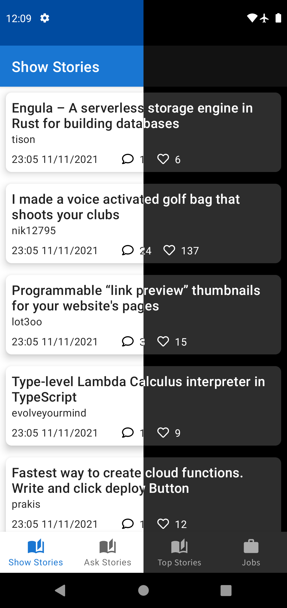

<div align="center">
    
   <h1 align="center"> HackerNews </h1>
   <p align="center">Android app consuming <a href="https://hacker-news.firebaseio.com/v0/">HackerNews API</a>, built with modern android architecture components.</p>
   <a  href="https://codebeat.co/projects/github-com-fayaz07-hackernews-main"></a> 
   <a href="https://www.codacy.com/gh/fayaz07/HackerNews/dashboard?utm_source=github.com&amp;utm_medium=referral&amp;utm_content=fayaz07/HackerNews&amp;utm_campaign=Badge_Grade"></a> 
   <a href="https://circleci.com/gh/fayaz07/HackerNews/tree/main"></a> 
   <a href="https://ktlint.github.io/"></a>
   <a href="https://github.com/fayaz07/HackerNews/actions/workflows/ktlint.yml"> </a>
</div>

## About app

1. Manages dependencies using Gradle's [**version catalog and toml**](https://docs.gradle.org/current/userguide/platforms.html) config.
2. Android [Splash Screen](https://developer.android.com/guide/topics/ui/splash-screen) API
3. [ViewBinding](https://developer.android.com/topic/libraries/view-binding)
4. [Navigation Components](https://developer.android.com/guide/navigation/navigation-getting-started) using Fragments
5. [LiveData](https://developer.android.com/reference/android/arch/lifecycle/LiveData) & [ViewModel](https://developer.android.com/reference/android/arch/lifecycle/ViewModel)
6. [Dagger2](https://developer.android.com/training/dependency-injection/dagger-basics) + [Hilt](https://developer.android.com/training/dependency-injection/hilt-android) - dependency injection
7. [Retrofit](https://square.github.io/retrofit/)
8. [Room](https://developer.android.com/training/data-storage/room)
9. [Paging3](https://developer.android.com/topic/libraries/architecture/paging/v3-overview), [PagingDataAdapter](https://developer.android.com/reference/kotlin/androidx/paging/PagingDataAdapter), [LoadStateAdapter](https://developer.android.com/reference/kotlin/androidx/paging/LoadStateAdapter)
10. [RecyclerView](https://developer.android.com/guide/topics/ui/layout/recyclerview), [ListAdapter](https://developer.android.com/reference/androidx/recyclerview/widget/ListAdapter)
11. [GSON](https://github.com/google/gson)
12. [Kotlin Flow](https://developer.android.com/kotlin/flow)
13. [Material Design](https://material.io/develop/android)
14. [Kotlin Coroutines](https://developer.android.com/kotlin/coroutines)

## Screenshots



## Config

Add HackerNews API's baseUrl in `local.properties` file

```properties
hn.baseUrl=https://hacker-news.firebaseio.com/
hn.apiVersion=v0/
```

# MAD Scorecard

https://madscorecard.withgoogle.com/scorecards/1383581412/


